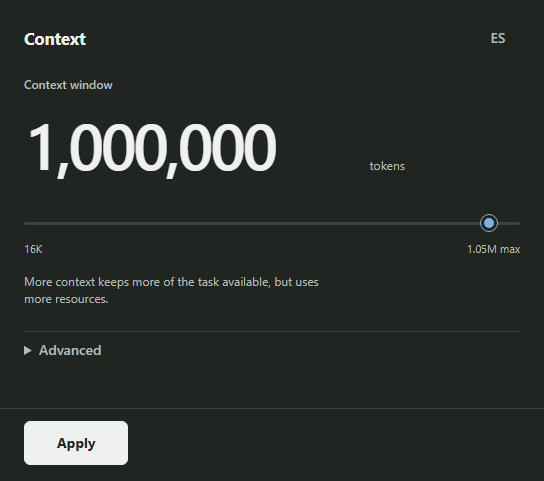

# Context Switch

A small desktop control for the Codex context window. Pick an amount, apply it, or restore the setup you had before.

> Community project. Not an official OpenAI product.



## Download

Open the [latest release](https://github.com/codavidgarcia/codex-context-switch/releases/latest) and choose:

- **Windows portable:** download the portable `.exe` and double-click it. Nothing is installed.
- **Windows setup:** download the setup `.exe` for desktop and Start menu shortcuts.
- **macOS:** download the `.dmg`.
- **Linux:** download the `.AppImage` or `.deb`.

The builds are not code-signed yet, so the operating system may ask you to confirm that you trust the app.

## What it changes

Context Switch manages these top-level settings in `~/.codex/config.toml` (or `$CODEX_HOME/config.toml`):

```toml
model = "gpt-5.6-sol"
model_context_window = 1000000
model_auto_compact_token_limit = 900000
```

The context window can be customized from 16,000 through GPT-5.6 Sol's 1,050,000-token model limit. Compaction defaults to 90% of the selected value and can be changed under **Advanced**.

Restart Codex and begin a new task after applying or restoring a setup.

## Reversibility and safety

- The first apply stores the exact managed lines that existed before the change.
- Restore changes only those three keys; unrelated settings, comments, sections, and line endings remain intact.
- If a managed setting changes outside the app, Context Switch refuses to overwrite it.
- Runtime assets are bundled. The app has no telemetry, analytics, or network dependency.
- The renderer is sandboxed, has no Node.js access, and can request only status, apply, and restore operations through its preload bridge.

Restore state lives beside the Codex config as `context-switch-state.json` and is removed after a successful restore.

## Develop

Requires Node.js 22.12 or newer.

```bash
git clone https://github.com/codavidgarcia/codex-context-switch.git
cd codex-context-switch
npm install
npm run check
npm start
```

Build packages for the current operating system with `npm run dist`. On Windows, `npm run dist:win` produces both the installer and portable executable.

## References

- [GPT-5.6 Sol model page](https://developers.openai.com/api/docs/models/gpt-5.6-sol)
- [Codex configuration reference](https://learn.chatgpt.com/docs/config-file/config-reference)
- [Electron security checklist](https://www.electronjs.org/docs/latest/tutorial/security)

## License

MIT
